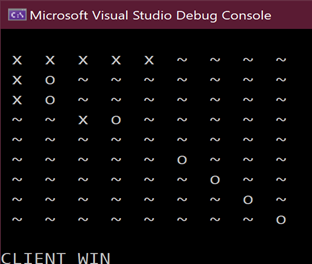

# Gomoku
A network based Gomoku game written in C++

## Introduction

Gomoku is a game played on a 15x15 board. The goal is to get 5 stones in a row, either horizontally, vertically or diagonally. The game is played by two players, black and white. The black player starts the game. The game ends when one of the players gets 5 stones in a row or when the board is full.

## Environment
- Windows 10
- Visual Studio 2019 as compiler
- C++ 11

## Projects highlight
- A network based game
- Automatic game room creation(when a player enters the game, it becomes the host of a game room)
- Automatic game room matching(when second player enters the game, it becomes the client, and will automatically connect to the host)
- Save game record
- The server and client is connected by TCP socket
- Game condition is transmitted by custom struct

## Screenshots

## Usage
- Open the solution file in Visual Studio 2019
- Build the project
- Run the executable file on two players' computers

## Usefull links
- [Gomoku](https://en.wikipedia.org/wiki/Gomoku)
- [Windows socket](https://docs.microsoft.com/en-us/windows/win32/winsock/complete-client-code)
- [multicast](https://en.wikipedia.org/wiki/IP_multicast)

## Books
- [C++ Primer Plus](https://www.amazon.com/Primer-Plus-6th-Developers-Library/dp/0321776402)
- [C++ network programming](https://www.amazon.com/Network-Programming-Mastering-Complexity-Patterns/dp/0201604647)
